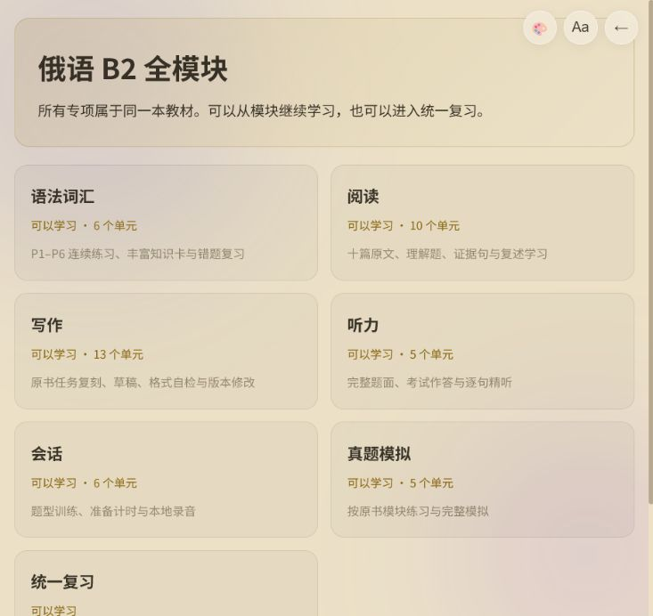
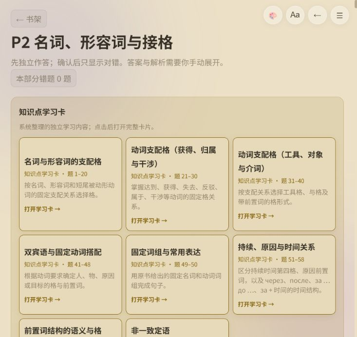
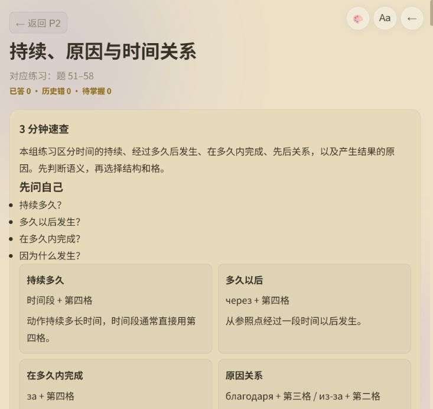
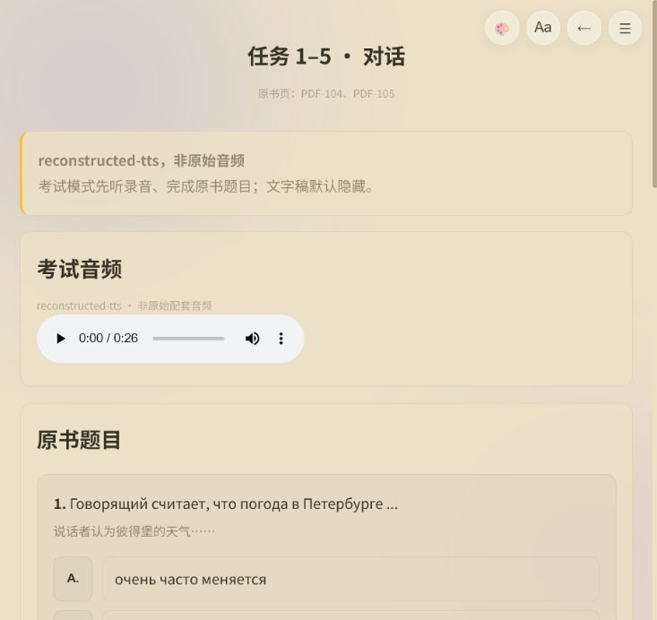
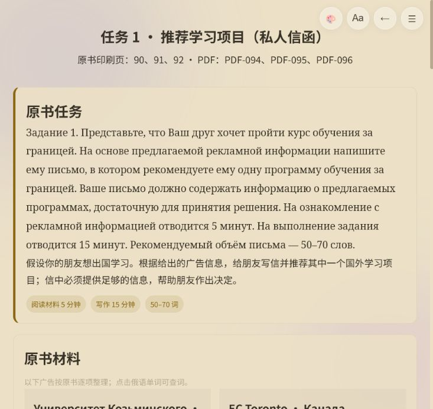
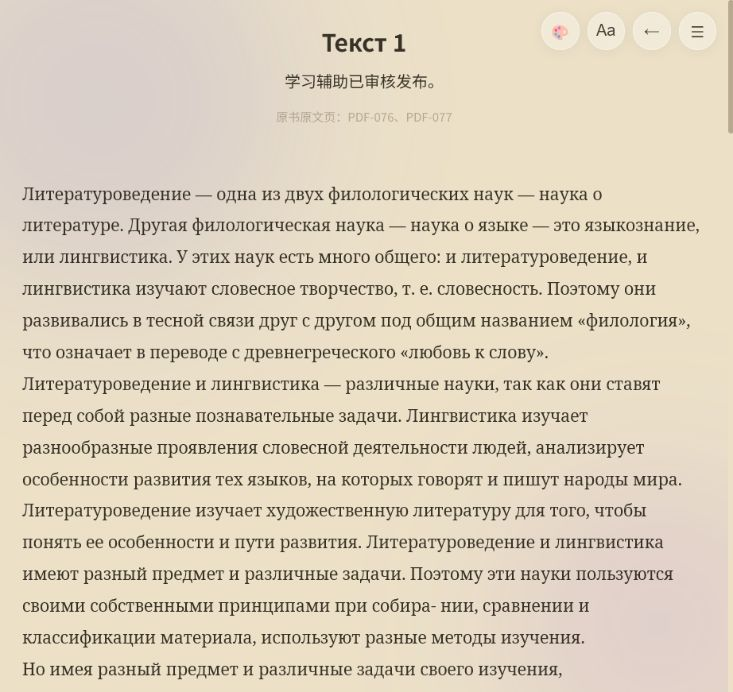

# 俄语学习阅读器功能体验审查

日期：2026-07-18

## 审查范围

本次以“继续上次学习 → B2 仪表盘 → 语法 P2 → 知识卡 → 听力 → 写作 → 阅读”为主流程，检查任务入口、学习闭环、长内容定位、进度反馈、交互一致性和截图可见的无障碍风险。

## 总体结论

内容层已经具备很强的学习价值：语法知识卡、完整听力题面、写作原书材料、阅读译文与复述辅助都已形成。但产品层仍更像“多个优秀学习页面的集合”，还没有完全变成一个能每天稳定使用的学习系统。优先级最高的是恢复路径、统一进度与复习、长页面定位，以及剩余 OCR 污染治理。

## 流程步骤

### 1. 自动恢复上次学习 — 异常

- 恢复 P2 时只保存了 `bookId + chapter`，没有保存 B2 `moduleId`；页面被当成普通阅读章节，出现“本章暂无内容”和旧式“练习题”折叠区。
- 这是阻断型问题：用户可能误以为内容丢失。
- 建议保存稳定路由：`bookId + moduleId + unitId + viewMode + scroll/activeQuestionId`，恢复失败时回到 B2 仪表盘并显示“继续上次学习”。

### 2. B2 仪表盘 — 健康，但缺少行动信息

- 七个模块的归属和入口清楚，卡片语言一致。
- 卡片只显示“可以学习”和单元数，没有完成率、上次位置、待复习数、草稿状态。
- “统一复习”当前实际跳转到语法错题本，并没有汇总阅读错题、听力错题、写作草稿和知识卡自测，文案与功能不一致。
- 建议新增顶部“继续学习”主卡，并在模块卡显示 `已完成 / 总数`、最近学习、待复习和草稿数。

### 3. P2 连续练习 — 内容完整，定位成本高

- 70 题保持原书连续顺序，知识卡入口与错题入口完整。
- 70 题全部铺在一个页面；知识卡又占据较大首屏，用户回到第 37、55、68 题成本高。
- 顶部悬浮返回与正文里的“← 书架”重复。
- 发现来源清理残留：`Ero`、`языкозна-`、第 56 题选项后的中文书名水印。
- 建议增加题号导航抽屉、未做/错题筛选、当前题锚点和“继续第 N 题”；保留连续顺序但只渲染当前附近题目或按知识点折叠。

### 4. 丰富知识卡 — 内容优秀，长页需要导航反馈

- 速查、详细课程、格变化、例句、即时检查、综合自测和来源分层完整。
- 顶部“返回 P2”和悬浮返回重复。
- 长页目录虽存在，但缺少当前章节高亮、阅读进度和“下一个小节”。
- 即时检查和综合自测在视觉上较相似，用户不易理解哪些会计入掌握记录。
- 建议做粘性目录、当前小节高亮、课程完成状态；明确标出“练习一下（不计分）”与“综合自测（计入掌握）”。

### 5. 听力考试页 — 主流程健康

- 录音、完整题目与“精听这段材料”入口顺序正确；文字稿默认隐藏。
- 缺少考试轮次状态：已答几题、一次提交、得分摘要、重听次数。
- 建议考试模式提供一次提交与完成摘要；精听模式提供句段循环、字幕同步、A/Б 说话人可视区分、变速和生词列表。考试模式不显示变速或逐句控制。

### 6. 写作工作台 — 内容健康，缺少写作执行工具

- 原书任务、材料、要求、草稿、版本、评分清单和范文边界清晰。
- 仍缺任务倒计时、目标字数区间反馈、版本对比和成品导出。
- 建议提供“考试计时 / 学习模式”，字数状态显示为不足/达标/超出；版本间可查看差异；支持导出 Markdown 或复制“题目 + 草稿 + 自查结果”。

### 7. 阅读练习 — 内容丰富，但学习辅助会提前泄题

- 原文、逐段译文、结构、可复用表达和复述路径质量高。
- 当前学习辅助位于理解题之前，第一次做题时会提前获得全文译文和结构答案。
- 长文章缺少段落导航、阅读位置和生词汇总。
- 建议与听力一致分成“考试阅读”和“精读学习”：考试模式先原文与题目，提交后开放译文、结构和复述；精读模式提供段落对照、段落音频、生词与复述记录。

## 建议优先级

### P0：先修可靠性

1. 修复 B2 模块化恢复：保存 `moduleId/unitId/viewMode/activeQuestionId`。
2. 建立来源文本卫生门禁，清理并自动拦截拉丁字母混入、断行连字符、水印文字。
3. 统一导航，删除页面内部重复返回按钮。

### P1：形成日常学习闭环

1. 仪表盘增加“继续学习”、模块完成率、待复习和草稿状态。
2. 将“统一复习”升级为跨模块复习中心：语法/阅读/听力错题、知识卡自测、写作草稿、会话录音状态。
3. 语法增加题号导航、筛选和可靠的继续位置。
4. 阅读增加考试/精读双模式，避免学习辅助提前泄题。

### P2：提升各模块效率

1. 听力：一次提交、得分摘要、逐句循环、字幕同步、变速与生词汇总。
2. 写作：倒计时、字数区间、版本差异、导出。
3. 知识卡：粘性目录、当前小节、计分状态说明。
4. 全书搜索：按俄语、中文、题号、知识点和模块搜索，并直达原位置。

### P3：可访问性与长期维护

1. 为模块卡、知识卡和普通按钮补统一 `:focus-visible`；当前主要只有选项和输入框有明确焦点样式。
2. 提高浅色主题中辅助文字和禁用状态对比度。
3. 给点击目标保证至少约 44px；检查手机下粘性导航和词典抽屉是否遮挡正文。
4. 增加“报告题目问题”入口，自动带上稳定题号和来源页，便于持续清理资料。

## 推荐实施顺序

第一批建议合并完成：模块化恢复 + 仪表盘继续学习/进度 + 语法题号导航。它们共同解决“我上次学到哪里、现在该做什么、如何快速回去”。随后做跨模块复习中心，再做阅读双模式，最后逐模块补充听力和写作工具。

## 证据限制

- 本次检查了当前桌面窄窗口，但没有完成实体手机、屏幕阅读器和完整键盘遍历，不能据此声称符合 WCAG。
- 没有实际提交新的听力/阅读答案，也没有录制麦克风，避免污染用户已有学习记录和触发权限请求。
- 内容准确性只记录了界面中可见的明显 OCR 残留，未对全部题库重新逐题核书。
